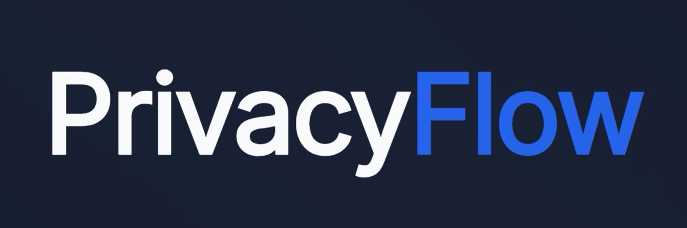

# n8n-nodes-privacyflow

[n8n](https://n8n.io/) community node for **PrivacyFlow** - privacy-first encrypted messaging for your workflows.

PrivacyFlow enables seamless automation with end-to-end encrypted messaging through **Signal**, **SimpleX**, and **Session**. Zero logging, zero big-tech, complete privacy.

[Installation](#installation) • [Features](#features) • [Operations](#operations) • [Credentials](#credentials) • [Usage Examples](#usage-examples) • [Security & Privacy](#security--privacy) • [Development](#development) • [Resources](#resources)

## Features

- **Privacy-First Messaging** - Send and receive messages through Signal, SimpleX, and Session
- **Zero Logging** - No message logging or tracking by PrivacyFlow
- **End-to-End Encryption** - All messages encrypted using the underlying protocol's E2EE
- **No Big-Tech Dependencies** - Self-hosted alternatives to mainstream messaging platforms
- **Seamless Automation** - Integrate encrypted messaging into your n8n workflows
- **Polling Trigger** - Automatically start workflows when new messages arrive

## Quick Start

### Installation

```bash
npm install n8n-nodes-privacyflow
```

Restart your n8n instance and the PrivacyFlow nodes will be available.

### Setup Credentials

1. Navigate to **Credentials** in n8n
2. Create a new **PrivacyFlow API** credential
3. Enter your API Key from [PrivacyFlow Dashboard](https://privacyflow.app)
4. Confirm the Base URL (default: `https://api.privacyflow.app`)
5. Test the connection

### Send Your First Message

1. Add a **PrivacyFlow** node to your workflow
2. Select **Message Actions** → **Send a text message**
3. Enter a Recipient (Contact ID) and your message
4. Execute the workflow

## Installation

Follow the [n8n community nodes installation guide](https://docs.n8n.io/integrations/community-nodes/installation/).

### Requirements

- n8n version 1.0.0 or higher
- PrivacyFlow API account ([sign up](https://privacyflow.app))

### Installing from npm

```bash
npm install n8n-nodes-privacyflow
```

Restart your n8n instance to load the nodes.

## Operations

### PrivacyFlow Node

The PrivacyFlow node provides two resources with multiple operations:

#### Message Actions

| Operation | Description |
|-----------|-------------|
| **Send a text message** | Send a plaintext message to a contact (max 10,000 characters) |
| **Get all unread messages** | Retrieve all unread messages from your PrivacyFlow inbox |

#### Contact Management

| Operation | Description |
|-----------|-------------|
| **List contacts** | Get all available contacts from your PrivacyFlow account |

### PrivacyFlow Trigger Node

The trigger node polls for new messages and starts workflows when they arrive.

| Setting | Description |
|---------|-------------|
| **Message Limit** | Maximum messages to retrieve per poll (1-100, default: 50) |

## Credentials

### PrivacyFlow API

To use PrivacyFlow nodes, you need to authenticate with your PrivacyFlow account.

**Prerequisites:**
- Create an account at [privacyflow.app](https://privacyflow.app)
- Generate an API Key from your dashboard

**Credential Fields:**

| Field | Description |
|-------|-------------|
| **API Key** | Your PrivacyFlow API key (serves as unique identifier) |
| **Base URL** | The PrivacyFlow API endpoint (default: `https://api.privacyflow.app`) |

**Authentication Method:** Bearer Token (API Key sent in `Authorization` header)

For detailed setup instructions, visit the [PrivacyFlow Documentation](https://docs.privacyflow.app).

## Usage Examples

### Example 1: Send a Message Workflow

A simple workflow to send a notification message:

```
Trigger Node → PrivacyFlow (Send Message) → Log Result
```

1. Start with any trigger node (Webhook, Schedule, etc.)
2. Add **PrivacyFlow** node → **Message Actions** → **Send a text message**
3. Set **Recipient** to your Contact ID
4. Set **Message** to your notification content
5. Execute the workflow

### Example 2: Poll and Respond Workflow

Automatically respond to incoming messages:

```
PrivacyFlow Trigger (Poll Messages) → Process Message → PrivacyFlow (Send Response)
```

1. Add **PrivacyFlow Trigger** node to start the workflow
2. Set **Message Limit** to 50 (or your preferred value)
3. Add a processing node (e.g., Function, HTTP Request)
4. Add **PrivacyFlow** node → **Send a text message**
5. Use expressions to dynamically set recipient and message from trigger output

### Example 3: Contact Management Workflow

List and manage your PrivacyFlow contacts:

```
Schedule Trigger → PrivacyFlow (List Contacts) → Filter/Process → CRM/Database
```

1. Add **Schedule Trigger** node
2. Add **PrivacyFlow** node → **Contact Management** → **List contacts**
3. Process the contact list as needed
4. Sync to external systems or databases

## Security & Privacy

PrivacyFlow is designed with security and privacy as core principles:

### Architecture & Dependencies

- **No External Package Dependencies** - This node package has no external dependencies beyond n8n-workflow
- **MIT License** - Open source and freely auditable
- **Code Review** - Source code available at [GitHub](https://github.com/privacyflow-app/n8n-nodes-privacyflow)

### Authentication & Encryption

| Security Feature | Implementation |
|-----------------|----------------|
| **API Authentication** | Bearer token authentication via Authorization header |
| **Transport Security** | All API requests use HTTPS/TLS |
| **End-to-End Encryption** | Messages encrypted by Signal, SimpleX, or Session protocols |
| **API Key Storage** | Keys stored securely in n8n credentials (encrypted at rest) |

### Privacy Guarantees

- **Zero Logging** - PrivacyFlow does not log message content or metadata
- **No Data Retention** - Messages are delivered directly to end users
- **No Big-Tech Integration** - Uses decentralized/self-hosted messaging platforms
- **No Tracking** - No analytics or tracking embedded in the node

### Error Handling

The node implements comprehensive error handling:

| Error Type | Response |
|------------|----------|
| **Authentication Failed (401)** | Clear error message to check API key |
| **Rate Limit Exceeded (429)** | Inform user to retry later |
| **Network Errors** | Detailed error messages for troubleshooting |
| **Validation Errors** | Clear messages for invalid inputs (empty recipient, message too long, etc.) |

### API Endpoints

The PrivacyFlow node communicates with the following API endpoints:

| Endpoint | Method | Purpose |
|----------|--------|---------|
| `/api/v1/health` | GET | Credential health check |
| `/api/v1/messages/send` | POST | Send a text message |
| `/api/v1/messages/unread` | GET | Get all unread messages |
| `/api/v1/messages/poll` | GET | Poll for new messages (trigger) |
| `/api/v1/contacts` | GET | List all contacts |

### Message Limits

| Constraint | Limit |
|------------|-------|
| **Message Length** | 10,000 characters maximum |
| **Poll Message Limit** | 1-100 messages per poll |
| **Rate Limiting** | Enforced by PrivacyFlow API |

## Development

### Prerequisites

- **[Node.js](https://nodejs.org/)** (v22 or higher) and npm
  - Linux/Mac/WSL: Install via [nvm](https://github.com/nvm-sh/nvm)
  - Windows: Follow [Microsoft's NodeJS guide](https://learn.microsoft.com/en-us/windows/dev-environment/javascript/nodejs-on-windows)
- **[git](https://git-scm.com/downloads)**

### Setup Development Environment

```bash
# Clone the repository
git clone https://github.com/privacyflow-app/n8n-nodes-privacyflow.git
cd n8n-nodes-privacyflow

# Install dependencies
npm install

# Start development server
npm run dev
```

The development server starts n8n with the PrivacyFlow nodes loaded and hot-reload enabled.

### Available Scripts

| Script | Description |
|--------|-------------|
| `npm run dev` | Start n8n with your nodes and watch for changes |
| `npm run build` | Compile TypeScript to JavaScript for production |
| `npm run build:watch` | Build in watch mode (auto-rebuild on changes) |
| `npm run lint` | Check code for errors and style issues |
| `npm run lint:fix` | Automatically fix linting issues when possible |
| `npm run release` | Create a new release |

### Code Structure

```
n8n-nodes-privacyflow/
├── credentials/
│   └── PrivacyFlowApi.credentials.ts    # API credential definition
├── nodes/
│   ├── PrivacyFlow/
│   │   ├── PrivacyFlow.node.ts       # Action node implementation
│   │   ├── PrivacyFlowTrigger.node.ts # Trigger node implementation
│   │   ├── PrivacyFlow.node.json     # Action node metadata
│   │   ├── PrivacyFlowTrigger.node.json # Trigger node metadata
│   │   └── resources/
│   │       ├── contact/              # Contact operations
│   │       └── message/               # Message operations
├── icons/
│   ├── banner.jpeg                   # Project banner (root directory)
│   ├── privacyflow.svg               # Light mode icon
│   └── privacyflow.dark.svg          # Dark mode icon
├── package.json                      # Package configuration
└── README.md                         # This file
```

### Architecture Overview

```
┌─────────────────────────────────────────────────────────────┐
│                      n8n Workflow Engine                      │
├─────────────────────────────────────────────────────────────┤
│                                                               │
│  ┌──────────────────┐         ┌──────────────────┐          │
│  │ PrivacyFlow      │         │ PrivacyFlow      │          │
│  │ Trigger Node     │         │ Action Node      │          │
│  └────────┬─────────┘         └────────┬─────────┘          │
│           │                            │                     │
│           └────────────┬───────────────┘                     │
│                        │                                     │
└────────────────────────┼─────────────────────────────────────┘
                         │
                         ▼
              ┌──────────────────────┐
              │   PrivacyFlow API    │
              └──────────┬───────────┘
                         │
         ┌───────────────┼───────────────┐
         │               │               │
         ▼               ▼               ▼
  ┌─────────────┐ ┌─────────────┐ ┌─────────────┐
  │  Signal     │ │  SimpleX    │ │  Session    │
  │  Protocol   │ │  Protocol   │ │  Protocol   │
  └──────┬──────┘ └──────┬──────┘ └──────┬──────┘
         │               │               │
         └───────────────┼───────────────┘
                         │
                         ▼
              ┌──────────────────────┐
              │    End User Device   │
              └──────────────────────┘
```

### Authentication Flow

```
User → n8n: Configure Credentials
n8n → PrivacyFlow Node: API Key + Base URL
PrivacyFlow Node → PrivacyFlow API: GET /api/v1/health
PrivacyFlow API: Credential Test
PrivacyFlow API → PrivacyFlow Node: 200 OK
PrivacyFlow Node → PrivacyFlow API: POST /api/v1/messages/send
  (Authorization: Bearer {apiKey})
PrivacyFlow API → PrivacyFlow Node: Message Sent
PrivacyFlow Node → n8n: Result
```

## Troubleshooting

### Node doesn't appear in n8n

1. Verify the package is installed: `npm list n8n-nodes-privacyflow`
2. Check that the node is registered in `package.json` under `n8n.nodes`
3. Restart the n8n dev server or your n8n instance
4. Check the n8n console for any error messages

### Authentication errors

1. Verify your API key is correct from the [PrivacyFlow Dashboard](https://privacyflow.app)
2. Ensure the Base URL is correct (default: `https://api.privacyflow.app`)
3. Test your credentials in the n8n credentials panel
4. Check if your API key has the required permissions

### Rate limiting errors

1. Wait a few minutes before retrying
2. Reduce polling frequency in the trigger node
3. Contact PrivacyFlow support if you need higher rate limits

### Network errors

1. Verify your network connection to `api.privacyflow.app`
2. Check if a firewall is blocking the connection
3. Verify the Base URL is correct for your region

### Linting errors

```bash
# Auto-fix most linting issues
npm run lint:fix
```

For remaining errors, review the n8n node development guidelines.

## Resources

- **[PrivacyFlow Documentation](https://docs.privacyflow.app)** - Complete API documentation and guides
- **[PrivacyFlow Homepage](https://privacyflow.app)** - Learn more about PrivacyFlow
- **[n8n Community Nodes Documentation](https://docs.n8n.io/integrations/community-nodes/)** - Official n8n community nodes guide
- **[n8n Community Forum](https://community.n8n.io/)** - Get help and share your workflows
- **[GitHub Repository](https://github.com/privacyflow-app/n8n-nodes-privacyflow)** - Source code and issues

## Compatibility

| Component | Minimum Version | Tested Versions |
|-----------|-----------------|-----------------|
| **n8n** | 1.0.0 | 1.0.0+ |
| **Node.js** | 22.0.0 | 22.x |

## License

[MIT License](https://github.com/privacyflow-app/n8n-nodes-privacyflow/blob/master/LICENSE.md)

## Contributing

Contributions are welcome! Please:

1. Fork the repository
2. Create a feature branch
3. Make your changes with clear commit messages
4. Ensure all tests pass and linting succeeds
5. Submit a pull request

For bug reports and feature requests, please use the [GitHub Issues](https://github.com/privacyflow-app/n8n-nodes-privacyflow/issues) page.
